# PawPortal - Design Approach and Details for Project Report

## 4. Design Approach and Details

### 4.1 System Architecture

#### 4.1.1 High-Level System Architecture

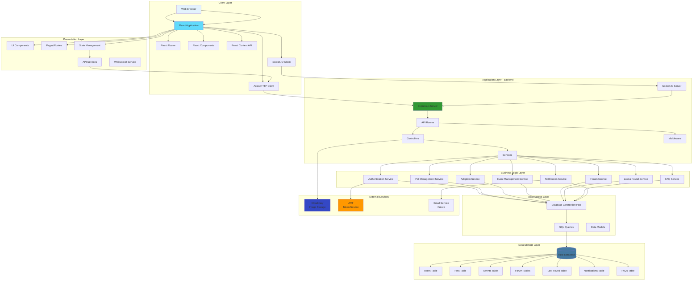

#### 4.1.2 Three-Tier Architecture

```mermaid
graph TB
    subgraph "Tier 1: Presentation Tier"
        A[React Frontend Application]
        A1[User Interface Components]
        A2[Pages & Routes]
        A3[State Management]
        A4[API Client Layer]
        A --> A1
        A --> A2
        A --> A3
        A --> A4
    end

    subgraph "Tier 2: Application Tier"
        B[Express.js Backend Server]
        B1[HTTP API Endpoints]
        B2[WebSocket Server]
        B3[Business Logic Controllers]
        B4[Authentication Middleware]
        B5[Authorization Middleware]
        B6[Error Handling]
        B --> B1
        B --> B2
        B --> B3
        B --> B4
        B --> B5
        B --> B6
    end

    subgraph "Tier 3: Data Tier"
        C[TiDB Database]
        C1[Relational Database]
        C2[Data Tables]
        C3[Indexes & Constraints]
        C --> C1
        C1 --> C2
        C1 --> C3
    end

    subgraph "External Services"
        D[Cloudinary<br/>Image Storage]
        E[JWT Authentication]
        F[Socket.IO<br/>Real-time Communication]
    end

    A4 -->|HTTP/HTTPS| B1
    A4 -->|WebSocket| B2
    B3 -->|SQL Queries| C1
    B3 -->|Image Upload| D
    B4 -->|Token Validation| E
    B2 -->|Real-time Events| F

    style A fill:#61dafb
    style B fill:#339933
    style C fill:#4479a1
    style D fill:#3448c5
    style E fill:#ff9800
    style F fill:#010101
```

---

### 4.2 Design Diagrams

#### 4.2.1 Data Flow Diagram (DFD) - Level 0 (Context Diagram)

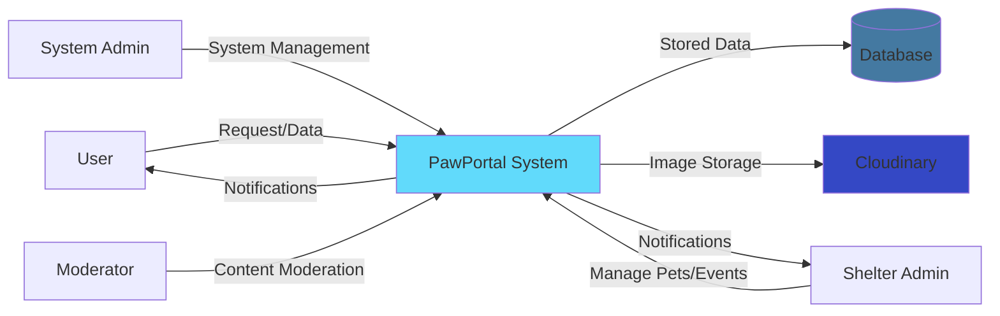

#### 4.2.2 Data Flow Diagram (DFD) - Level 1

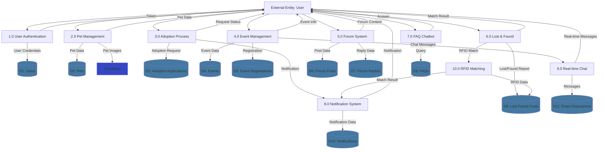

#### 4.2.3 Data Flow Diagram (DFD) - Level 2 (Pet Adoption Process)

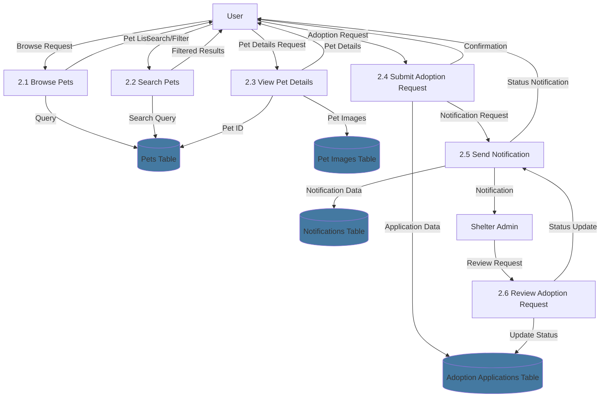

---

#### 4.2.4 Use Case Diagram

```mermaid
graph TB
    subgraph "Actors"
        A1[Guest User]
        A2[Pet Owner]
        A3[Shelter Admin]
        A4[Moderator]
        A5[System Admin]
    end

    subgraph "Authentication Use Cases"
        UC1[Register Account]
        UC2[Login]
        UC3[Logout]
        UC4[Update Profile]
        UC5[Reset Password]
    end

    subgraph "Pet Management Use Cases"
        UC6[Browse Pets]
        UC7[Search Pets]
        UC8[View Pet Details]
        UC9[Add Pet]
        UC10[Edit Pet]
        UC11[Delete Pet]
        UC12[Upload Pet Images]
        UC13[Manage Pet Health Records]
    end

    subgraph "Adoption Use Cases"
        UC14[Submit Adoption Request]
        UC15[View Adoption Status]
        UC16[Review Adoption Requests]
        UC17[Approve/Reject Adoption]
        UC18[Track Adoption History]
    end

    subgraph "Event Management Use Cases"
        UC19[Browse Events]
        UC20[Create Event]
        UC21[Register for Event]
        UC22[Cancel Event Registration]
        UC23[View Event Details]
        UC24[Participate in Event Chat]
    end

    subgraph "Forum Use Cases"
        UC25[View Forum Posts]
        UC26[Create Forum Post]
        UC27[Reply to Post]
        UC28[Moderate Posts]
        UC29[Delete Posts]
    end

    subgraph "Lost & Found Use Cases"
        UC30[Report Lost Pet]
        UC31[Report Found Pet]
        UC32[Search Lost/Found Pets]
        UC33[Match RFID]
        UC34[Update Lost/Found Status]
    end

    subgraph "FAQ Use Cases"
        UC35[Query FAQ Chatbot]
        UC36[View FAQ Answers]
        UC37[Manage FAQs]
        UC38[View FAQ Statistics]
    end

    subgraph "Administration Use Cases"
        UC39[Manage Users]
        UC40[Manage Roles]
        UC41[View Analytics]
        UC42[Manage System Settings]
        UC43[View System Logs]
    end

    subgraph "Notification Use Cases"
        UC44[View Notifications]
        UC45[Mark Notification as Read]
        UC46[Send Notifications]
    end

    %% Guest User
    A1 --> UC1
    A1 --> UC2
    A1 --> UC6
    A1 --> UC7
    A1 --> UC8
    A1 --> UC19
    A1 --> UC23
    A1 --> UC25
    A1 --> UC30
    A1 --> UC31
    A1 --> UC32
    A1 --> UC35
    A1 --> UC36

    %% Pet Owner
    A2 --> UC2
    A2 --> UC3
    A2 --> UC4
    A2 --> UC6
    A2 --> UC7
    A2 --> UC8
    A2 --> UC9
    A2 --> UC10
    A2 --> UC11
    A2 --> UC12
    A2 --> UC13
    A2 --> UC14
    A2 --> UC15
    A2 --> UC19
    A2 --> UC21
    A2 --> UC22
    A2 --> UC23
    A2 --> UC24
    A2 --> UC25
    A2 --> UC26
    A2 --> UC27
    A2 --> UC30
    A2 --> UC31
    A2 --> UC32
    A2 --> UC35
    A2 --> UC44
    A2 --> UC45

    %% Shelter Admin
    A3 --> UC2
    A3 --> UC3
    A3 --> UC9
    A3 --> UC10
    A3 --> UC11
    A3 --> UC12
    A3 --> UC16
    A3 --> UC17
    A3 --> UC18
    A3 --> UC20
    A3 --> UC23
    A3 --> UC41
    A3 --> UC44
    A3 --> UC45
    A3 --> UC46

    %% Moderator
    A4 --> UC2
    A4 --> UC3
    A4 --> UC28
    A4 --> UC29
    A4 --> UC39
    A4 --> UC41
    A4 --> UC44
    A4 --> UC45

    %% System Admin
    A5 --> UC2
    A5 --> UC3
    A5 --> UC37
    A5 --> UC38
    A5 --> UC39
    A5 --> UC40
    A5 --> UC41
    A5 --> UC42
    A5 --> UC43
    A5 --> UC44
    A5 --> UC45
    A5 --> UC46

    style A1 fill:#e3f2fd
    style A2 fill:#c8e6c9
    style A3 fill:#bbdefb
    style A4 fill:#fff9c4
    style A5 fill:#ffcdd2
```

---

#### 4.2.5 Class Diagram

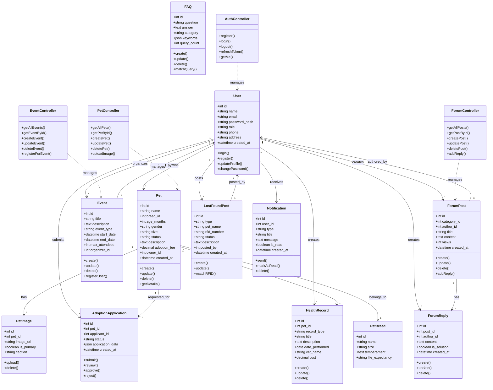

---

#### 4.2.6 Sequence Diagrams

##### Sequence Diagram 1: User Registration and Login

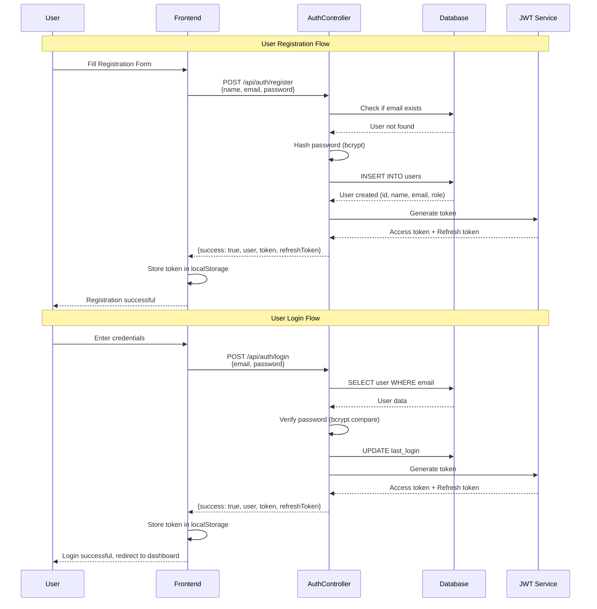

##### Sequence Diagram 2: Pet Adoption Process

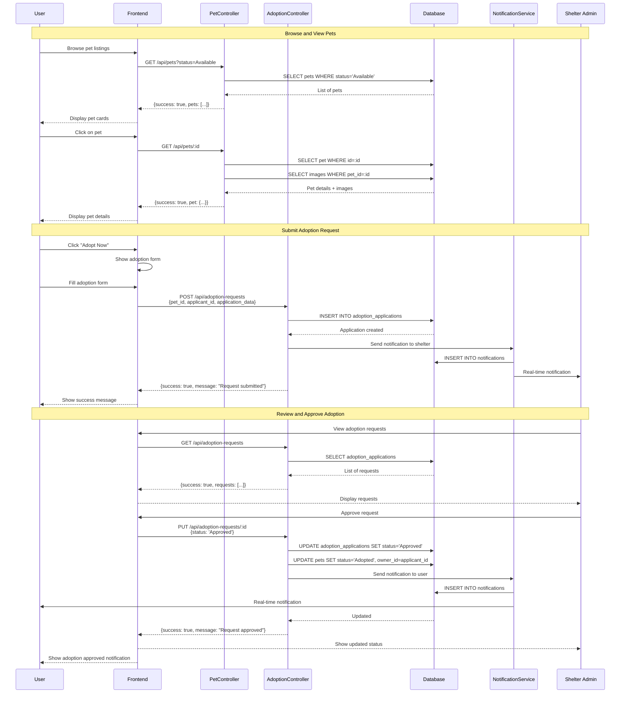

##### Sequence Diagram 3: Event Management and Real-time Chat

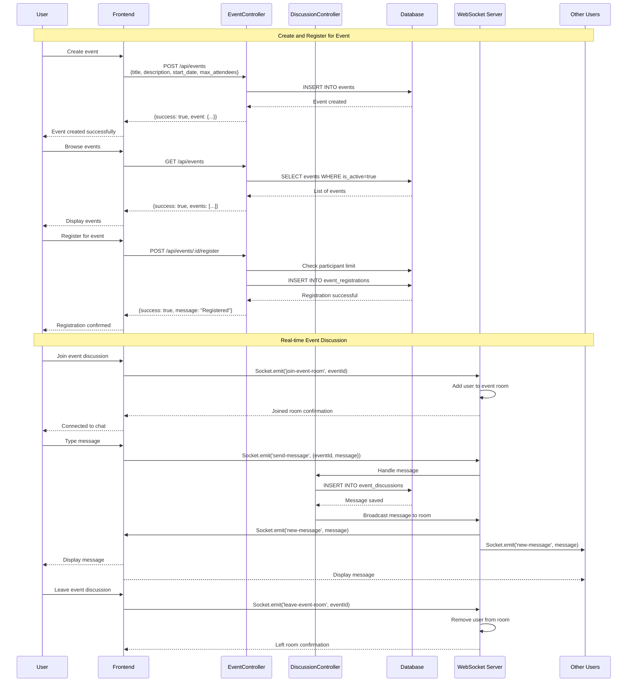

##### Sequence Diagram 4: Lost & Found with RFID Matching

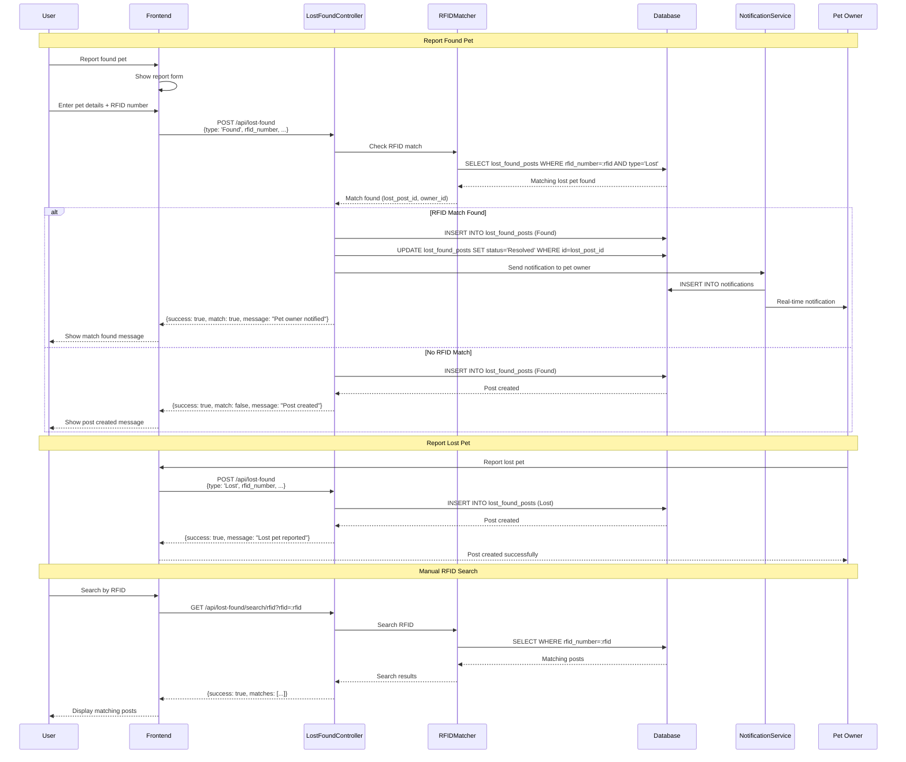

##### Sequence Diagram 5: FAQ Chatbot Query

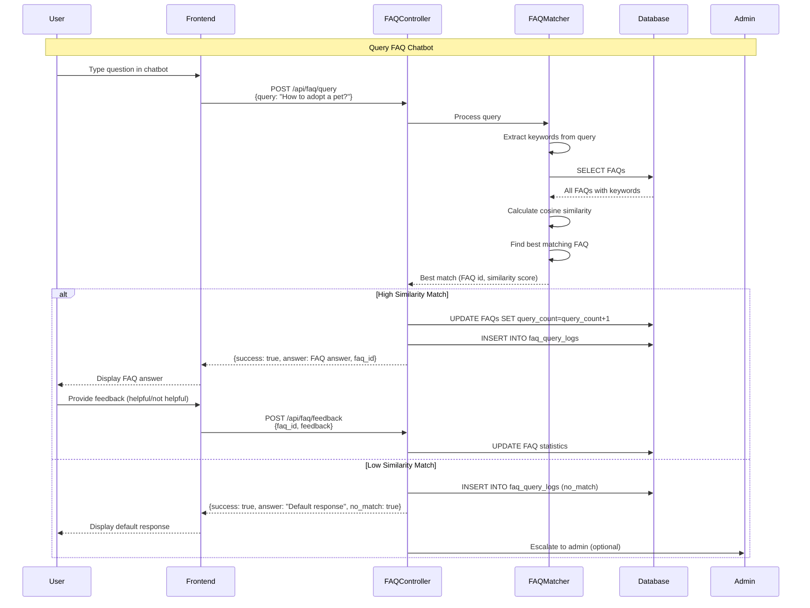

---

## Diagram Usage Instructions

### How to Use These Diagrams in Your Report

1. **Mermaid Live Editor**:
   - Copy the Mermaid code from any diagram
   - Visit https://mermaid.live/
   - Paste the code
   - Export as PNG or SVG

2. **VS Code**:
   - Install "Markdown Preview Mermaid Support" extension
   - Open this markdown file
   - Preview the diagrams
   - Export as needed

3. **GitHub/GitLab**:
   - Mermaid diagrams render automatically in markdown files
   - Simply commit the markdown file

4. **Alternative Tools**:
   - Draw.io (diagrams.net) - Import/export Mermaid
   - PlantUML - Convert Mermaid to PlantUML if needed
   - Lucidchart - Manual recreation for professional presentations

### Diagram Descriptions for Report

**4.1 System Architecture**:
- Shows the overall system structure with three-tier architecture
- Demonstrates separation of concerns (Presentation, Application, Data layers)
- Illustrates integration with external services

**4.2.1 Data Flow Diagram (DFD)**:
- Level 0: Context diagram showing system boundaries
- Level 1: Major processes and data stores
- Level 2: Detailed process decomposition (Pet Adoption example)

**4.2.2 Use Case Diagram**:
- Shows all actors (user roles) and their interactions
- Demonstrates system functionality from user perspective
- Organized by feature modules

**4.2.3 Class Diagram**:
- Shows system entities and their relationships
- Demonstrates object-oriented design
- Includes attributes and methods

**4.2.4 Sequence Diagrams**:
- User Registration and Login
- Pet Adoption Process
- Event Management with Real-time Chat
- Lost & Found with RFID Matching
- FAQ Chatbot Query

---

## Notes

- All diagrams are in Mermaid format for easy rendering and editing
- Diagrams can be customized with colors and styles as needed
- Sequence diagrams show detailed interaction flows
- Class diagram represents the data model and business logic
- Use case diagram covers all major system features
- Data flow diagrams show data movement through the system

