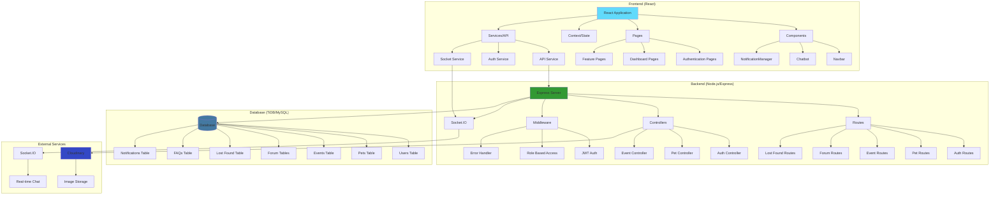
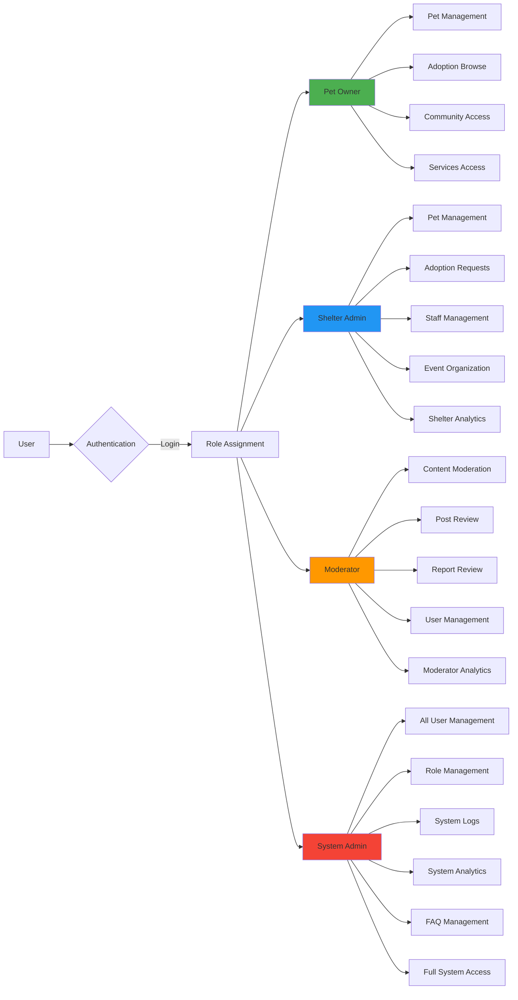
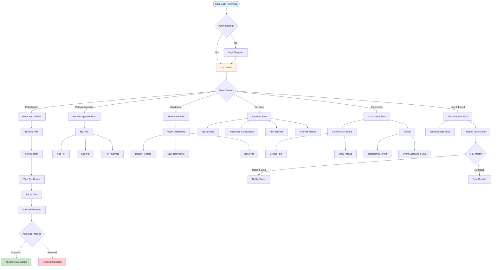
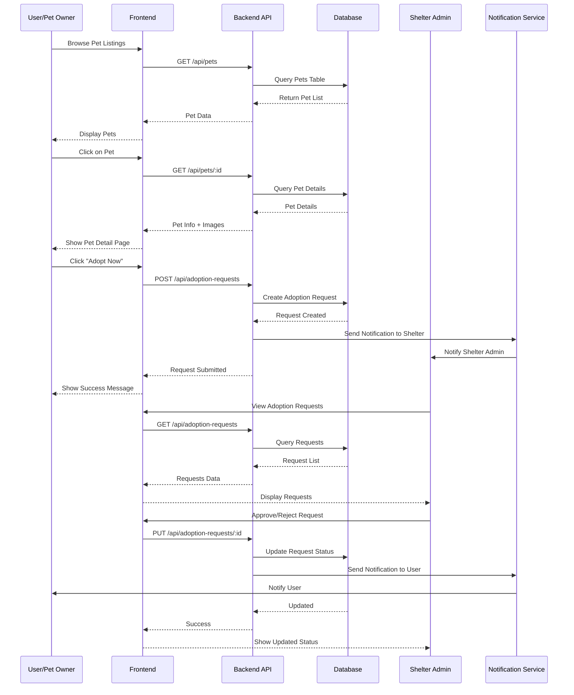
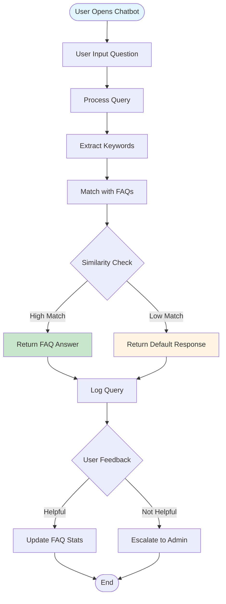
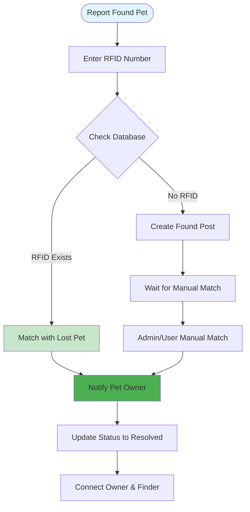
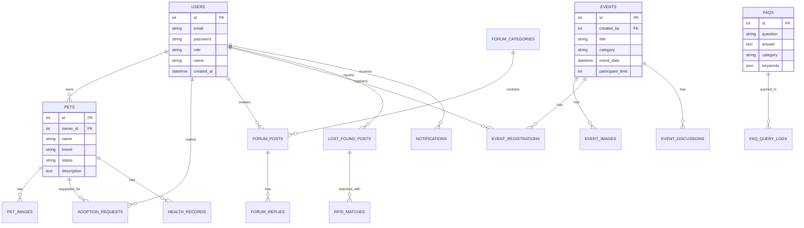
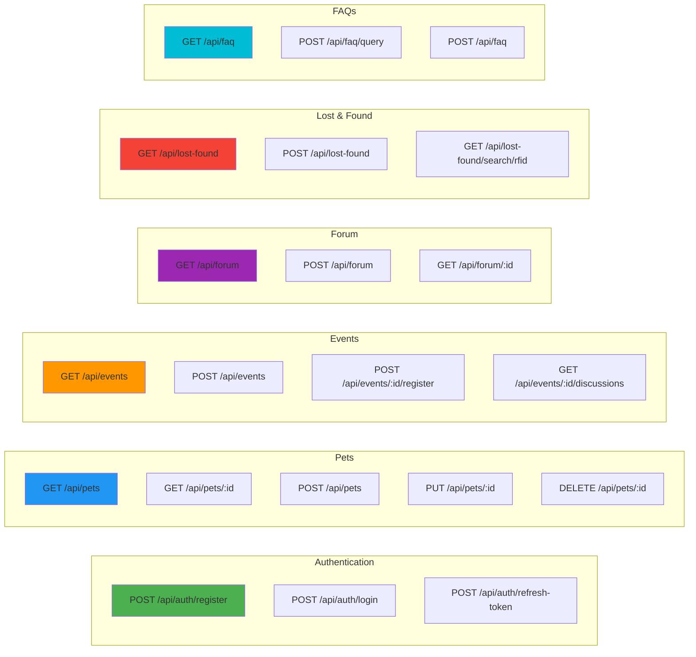

# PawPortal Architecture & System Overview

## Mermaid Diagrams

### 1. System Architecture Overview

### 2. User Roles & Access Control

### 3. Feature Flow Diagram

### 4. Data Flow - Pet Adoption Process

### 5. Real-time Features (Socket.IO)

```mermaid
graph TB
    subgraph "Client Side"
        A[React App] --> B[Socket Service]
        B --> C[Event Listeners]
    end

    subgraph "Server Side"
        D[Express Server] --> E[Socket.IO Server]
        E --> F[Event Handlers]
        F --> G[Room Management]
        F --> H[Message Broadcasting]
    end

    subgraph "Events"
        I[Event Discussion]
        J[Real-time Chat]
        K[Notifications]
        L[Live Updates]
    end

    B <-->|WebSocket Connection| E
    C --> I
    C --> J
    C --> K
    C --> L
    
    F --> I
    F --> J
    F --> K
    F --> L

    G --> M[Event Rooms]
    G --> N[User Rooms]
    
    H --> O[Broadcast to Room]
    H --> P[Broadcast to User]

    style A fill:#61dafb
    style E fill:#010101
    style I fill:#4CAF50
    style J fill:#2196F3
```

### 6. FAQ Chatbot Flow

### 7. RFID Matching System

### 8. Database Schema Overview

### 9. API Endpoints Overview

### 10. Complete System Overview

```mermaid
graph TB
    subgraph "Presentation Layer"
        A[React Frontend]
        A1[User Interface]
        A2[Components]
        A3[Pages]
        A --> A1
        A --> A2
        A --> A3
    end

    subgraph "Application Layer"
        B[Express.js Backend]
        B1[API Routes]
        B2[Controllers]
        B3[Middleware]
        B4[Services]
        B --> B1
        B --> B2
        B --> B3
        B --> B4
    end

    subgraph "Business Logic"
        C1[Authentication & Authorization]
        C2[Pet Management]
        C3[Adoption Process]
        C4[Event Management]
        C5[Community Features]
        C6[Lost & Found]
        C7[FAQ System]
        C8[Analytics]
    end

    subgraph "Data Layer"
        D[TiDB Database]
        D1[Users]
        D2[Pets]
        D3[Events]
        D4[Forum]
        D5[Lost Found]
        D6[FAQs]
        D --> D1
        D --> D2
        D --> D3
        D --> D4
        D --> D5
        D --> D6
    end

    subgraph "External Services"
        E1[Cloudinary - Image Storage]
        E2[Socket.IO - Real-time]
        E3[JWT - Authentication]
    end

    A --> B
    B1 --> C1
    B1 --> C2
    B1 --> C3
    B1 --> C4
    B1 --> C5
    B1 --> C6
    B1 --> C7
    B1 --> C8
    C1 --> D
    C2 --> D
    C3 --> D
    C4 --> D
    C5 --> D
    C6 --> D
    C7 --> D
    C8 --> D
    B --> E1
    B --> E2
    B --> E3

    style A fill:#61dafb
    style B fill:#339933
    style D fill:#4479a1
    style E1 fill:#3448c5
    style E2 fill:#010101
```

---

## Key Features Summary

### Core Features
1. **Pet Adoption** - Browse, search, and adopt pets
2. **Pet Management** - Manage pet profiles, health records, analytics
3. **Healthcare** - Health dashboard, care reminders, vet booking
4. **Services** - Vet booking, insurance, trainers, pet walkers
5. **Community** - Forums, events, discussions
6. **Lost & Found** - Report and find lost pets with RFID matching
7. **Chatbot** - AI-powered FAQ system
8. **Notifications** - Real-time notification system

### Admin Features
1. **Shelter Admin** - Manage pets, staff, events, adoption requests
2. **Moderator** - Content moderation, user management
3. **System Admin** - Complete system control, analytics, FAQ management

### Technical Features
1. **Real-time Chat** - Socket.IO for event discussions
2. **RFID Matching** - Automatic and manual pet matching
3. **Image Upload** - Cloudinary integration
4. **Role-based Access** - JWT authentication with roles
5. **Analytics** - Comprehensive analytics for all user types

---

## Technology Stack

- **Frontend**: React, React Router, Tailwind CSS
- **Backend**: Node.js, Express.js
- **Database**: TiDB (MySQL compatible)
- **Real-time**: Socket.IO
- **Authentication**: JWT
- **File Storage**: Cloudinary
- **State Management**: React Context API

---

## How to Use These Diagrams

1. **Copy the Mermaid code** from any section above
2. **Paste into a Mermaid editor**:
   - Online: https://mermaid.live/
   - VS Code: Install "Markdown Preview Mermaid Support" extension
   - GitHub: Mermaid diagrams render automatically in markdown files
3. **Export as image** (PNG, SVG) from the editor
4. **Use in presentations** or documentation

---

## Notes

- All diagrams are written in Mermaid syntax
- You can modify colors, styles, and connections as needed
- Diagrams can be combined or separated based on your needs
- Some diagrams show simplified flows - actual implementation may have more steps

